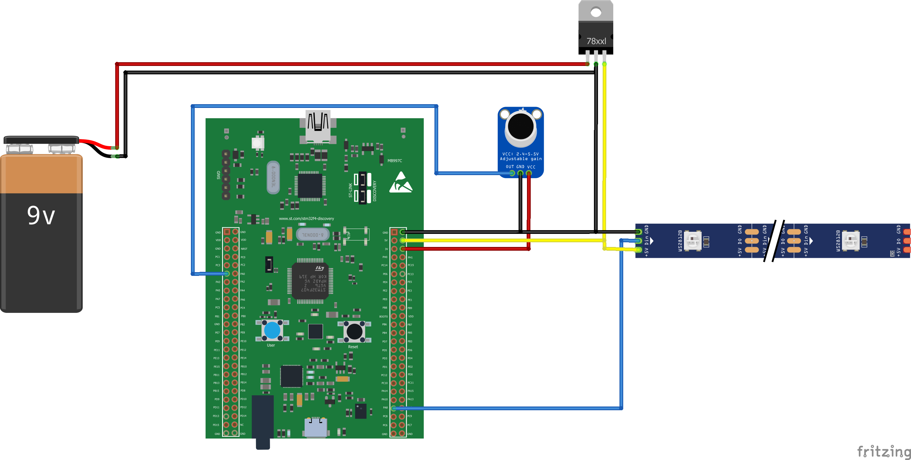

#  Music Reactive LEDs with STM32


## Hardware Setup

* **STM32F4-DISCO1** board
* **WS2812B LED strip**
* **MAX4466 microphone module**
* Optional: You can use a capacitor (≈15V) connected in parallel with the power line to ensure stable operation

## Stack

* **C / Embedded C**
* **DMA** (Direct Memory Access)
* **ADC** (Analog-to-Digital Converter for audio input)
* **Timers / PWM** (for LED control & precise timing)
* **Discrete Fast Fourier Transform (D-FFT)** (frequency domain analysis)
* **CMSIS DSP** ( built-in signal processing support)

---

## System Flow

```
    "Audio Processing Flow"
    begin
        MAX4466 --> ADC
        ADC --|DMA Transfer|--> DIGITAL BUFFER (stored in ping-pong buffer)
        DIGITAL BUFFER --> D-FFT Analysis
        FFT --> CMD [LED Command Data]
    end

    "LED control Data Flow"
    begin
        CMD --|DMA Transfer|--> WS2812B
    end
```

## Wiring




## Acknowledgements

---

This implementation builds upon [CMSIS4](https://github.com/ARM-software/CMSIS_4).

---

